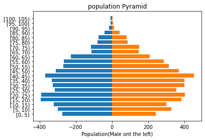
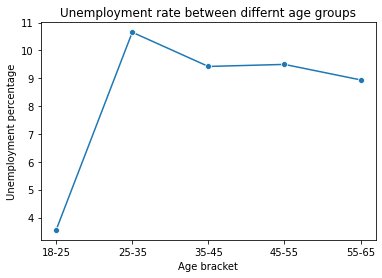
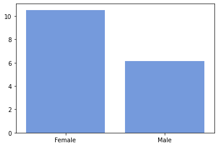
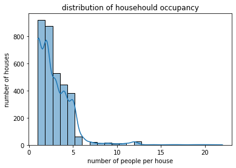

# Results

This folder contains the main visual outputs from the census demographic analysis.

## Population Age Structure

Shows the age distribution of the simulated town population and helps assess the balance between younger, working-age and older residents.

## Unemployment by Age

Shows how unemployment varies across different age groups within the working-age population.

## Unemployment by Gender

Compares unemployment patterns between genders.

## Household Occupancy

Shows the distribution of household sizes across the town and helps assess how existing housing is being used.
